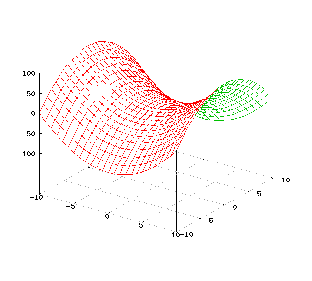

# Exercice 7 (vecteurs et pointeurs)

Différentes altitudes d'une étape du tour de France sont mémorisées dans un vecteur.


L'exercice consiste à écrire un programme qui calcule le nombre de cols dans l'étape.

NB : Attention : les appellations "cols" dans les noms des étapes ci-dessus ne sont pas liées à l'exercice.

Un "col" se définit par un point plus bas entre 2 points plus hauts (donc, de gauche à droite, il faut une descente, puis une montée.)



```c
void main()
{
	int etape[7]={538,330,928,597,234,1205,201}; 
	// à compléter
}
```

